# Целевая архитектура open-bsl 0.4.0

> **Статус:** архитектура принята, реализация не завершена. Документ описывает
> только целевое состояние 0.4.0 и не является снимком текущего кода.

Документ фиксирует нормативные топологию, владение, состояния и направления
зависимостей. Подробный BSL-контракт, результаты замеров 1С, лимиты по умолчанию,
этапы и проверки остаются в [`bsl-background-jobs.md`](bsl-background-jobs.md).
Файловая загрузка модулей определена в
[`bsl-use-modules.md`](bsl-use-modules.md), а async/HTTP-фундамент — в
[`bsl-http-client.md`](bsl-http-client.md). Если планы расходятся в нижнем ABI
модулей, авторитетен план фоновых заданий.

Rust-типы и методы на диаграммах написаны как в целевом API; роли, переходы и
причины ошибок — по-русски. Маркер `⚠ НЕ ИЗМЕРЕНО(ID)` означает, что структура
принята, но конкретная связь или переход ждёт замера платформы. Изменение
владения или топологии обновляет этот документ; изменение BSL-контракта, замера,
лимита или этапа — подробный план. Решение, затрагивающее обе области, меняет
оба файла одним коммитом.

## Карта представлений

| Представление | Диаграммы | Что фиксирует |
|---|---|---|
| Контекст и владение | `ARCH-01`–`ARCH-04` | Границы системы, crates, `EngineInner`, native/WASM |
| Конфигурация и bytecode | `ARCH-05`–`ARCH-08` | Сборка модулей, image/link ABI, сессионные модули, динамический код |
| Исполнение | `ARCH-09`–`ARCH-12` | VM-кванты, worker driver, HTTP/promise, parent/child jobs |
| Lifecycle | `ARCH-13`–`ARCH-17` | Runtime, job, worker, shutdown, ошибки и terminal transition |
| Данные и host-эффекты | `ARCH-18`–`ARCH-21` | DTO, бюджеты, временное хранилище и сообщения |
| Трассировка | матрица в конце | Покрытие решений подробного плана |

## A. Контекст и владение

### ARCH-01 — Системный контекст

`open-bsl` исполняет BSL в foreground-сеансах и изолированных фоновых сеансах.
Регламентные задания, расписания, пользователи, права, информационные базы,
журнал регистрации и `УведомленияКлиента` в 0.4.0 не моделируются.

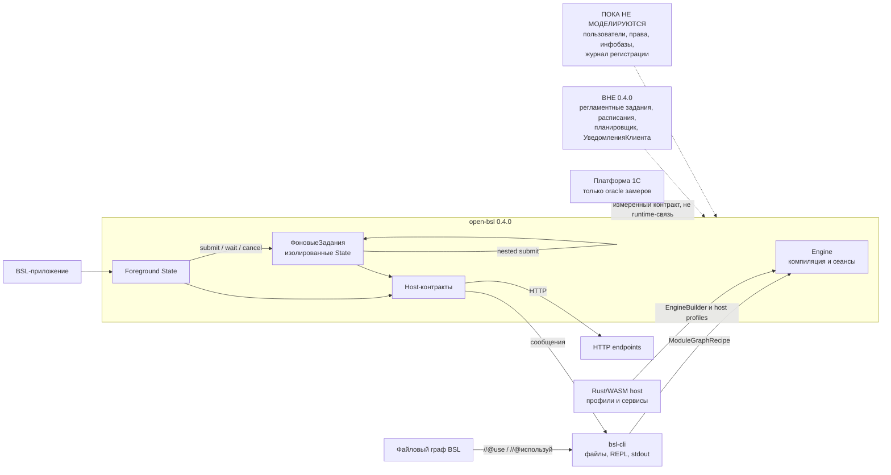
```mermaid
flowchart LR
    bsl["BSL-приложение"]
    cli["bsl-cli<br/>файлы, REPL, stdout"]
    embedder["Rust/WASM host<br/>профили и сервисы"]
    onec["Платформа 1С<br/>только oracle замеров"]
    http["HTTP endpoints"]
    fs["Файловый граф BSL"]

    subgraph system["open-bsl 0.4.0"]
        engine["Engine<br/>компиляция и сеансы"]
        foreground["Foreground State"]
        background["ФоновыеЗадания<br/>изолированные State"]
    host_boundary["Host-контракты"]
    end

    deferred["ВНЕ 0.4.0<br/>регламентные задания, расписания,<br/>планировщик, УведомленияКлиента"]
    excluded["ПОКА НЕ МОДЕЛИРУЮТСЯ<br/>пользователи, права, инфобазы,<br/>журнал регистрации"]

    fs -->|"//@use / //@используй"| cli
    cli -->|"ModuleGraphRecipe"| engine
    embedder -->|"EngineBuilder и host profiles"| engine
    bsl --> foreground
    foreground -->|"submit / wait / cancel"| background
    background -->|"nested submit"| background
    foreground --> host_boundary
    background --> host_boundary
    host_boundary -->|"HTTP"| http
    host_boundary -->|"сообщения"| cli
    onec -.->|"измеренный контракт, не runtime-связь"| system
    deferred -.-> system
    excluded -.-> system
```

Нативный стандартный `Engine` автоматически компонует job-сервис; Engine без
заданий не создаёт OS-потоков. На всех target BSL-типы зарегистрированы, но без
внедрённого `BackgroundJobService` запуск возвращает ловимую ошибку возможности
host.

### ARCH-02 — Компоненты и разрешённые зависимости

Crates остаются направленным конвейером. Представление конфигурации принадлежит
`bsl-bytecode`, переносимые контракты — `bsl-rt`, исполнение — `bsl-vm`, а
native orchestration и worker pool — фасаду `open-bsl`.

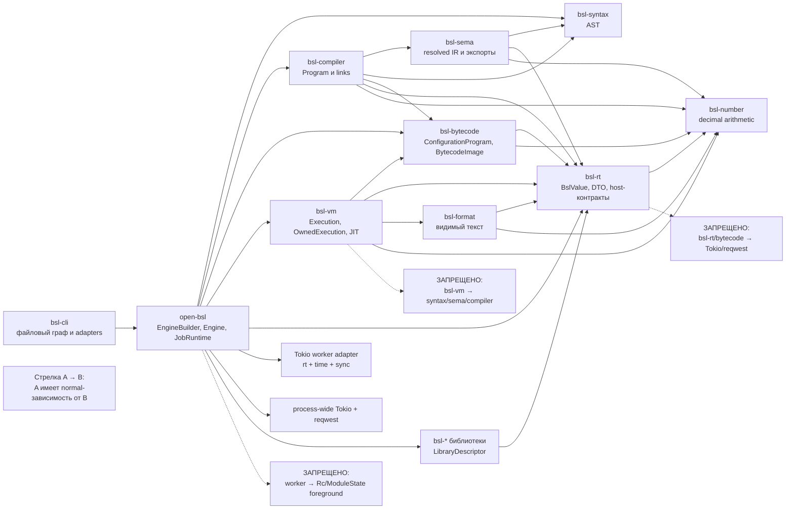
```mermaid
flowchart LR
    cli["bsl-cli<br/>файловый граф и adapters"]
    facade["open-bsl<br/>EngineBuilder, Engine, JobRuntime"]
    syntax["bsl-syntax<br/>AST"]
    sema["bsl-sema<br/>resolved IR и экспорты"]
    compiler["bsl-compiler<br/>Program и links"]
    bytecode["bsl-bytecode<br/>ConfigurationProgram, BytecodeImage"]
    vm["bsl-vm<br/>Execution, OwnedExecution, JIT"]
    rt["bsl-rt<br/>BslValue, DTO, host-контракты"]
    number["bsl-number<br/>decimal arithmetic"]
    format["bsl-format<br/>видимый текст"]
    libs["bsl-* библиотеки<br/>LibraryDescriptor"]
    tokio_worker["Tokio worker adapter<br/>rt + time + sync"]
    http_adapter["process-wide Tokio + reqwest"]

    legend["Стрелка A → B:<br/>A имеет normal-зависимость от B"]
    cli --> facade
    facade --> syntax
    sema --> syntax
    sema --> rt
    sema --> number
    compiler --> sema
    compiler --> syntax
    compiler --> bytecode
    facade --> compiler
    facade --> bytecode
    facade --> vm
    facade --> rt
    facade --> tokio_worker
    facade --> http_adapter
    vm --> bytecode
    vm --> rt
    vm --> format
    format --> rt
    compiler --> rt
    compiler --> number
    bytecode --> rt
    bytecode --> number
    vm --> number
    rt --> number
    format --> number
    libs --> rt
    facade --> libs

    forbidden1["ЗАПРЕЩЕНО:<br/>bsl-vm → syntax/sema/compiler"]
    forbidden2["ЗАПРЕЩЕНО:<br/>bsl-rt/bytecode → Tokio/reqwest"]
    forbidden3["ЗАПРЕЩЕНО:<br/>worker → Rc/ModuleState foreground"]
    vm -.-> forbidden1
    rt -.-> forbidden2
    facade -.-> forbidden3
```

`bsl-vm` зависит от представления, но не от фронтенда. `bsl-rt` не получает
новой внешней зависимости; Tokio и `reqwest` скрыты native-адаптерами.
Компонентные методы остаются в `MethodDescriptor`, а общие встроенные функции —
в единой таблице `bsl-rt`.

### ARCH-03 — Владение внутри Engine

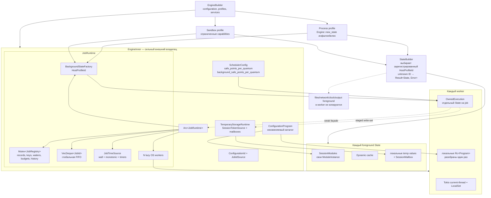
```mermaid
flowchart TB
    builder["EngineBuilder<br/>configuration, profiles, services"]

    subgraph engine["EngineInner — сильный внешний владелец"]
        config["ConfigurationProgram<br/>неизменяемый каталог"]
        scheduler["SchedulerConfig<br/>safe_points_per_quantum<br/>background_safe_points_per_quantum"]
        temp["TemporaryStorageRuntime<br/>SessionTokenSource + mailboxes"]
        ids["ConfigurationId + JobIdSource"]
        jobs["Arc&lt;JobRuntime&gt;"]

        subgraph runtime["JobRuntime"]
            registry["Mutex&lt;JobRegistry&gt;<br/>records, keys, waiters, budgets, history"]
            queue["VecDeque&lt;JobId&gt;<br/>глобальная FIFO"]
            factory["BackgroundStateFactory<br/>HostProfileId"]
            time["JobTimeSource<br/>wall + monotonic + timers"]
            workers["N lazy OS workers"]
        end
    end

    subgraph foreground["Каждый foreground State"]
        fg_modules["SessionModules<br/>свои ModuleInstance"]
        fg_dynamic["Dynamic cache"]
        fg_temp["локальные temp values<br/>+ SessionMailbox"]
    end

    state_builder["StateBuilder<br/>выбирает зарегистрированный HostProfileId<br/>unknown ID → Result&lt;State, Error&gt;"]
    process_profile["Process profile<br/>Engine::new_state инфаллибелен"]
    sandbox_profile["Sandbox profile<br/>ограниченные capabilities"]
    no_copy["files/network/clock/output foreground<br/>в worker не копируются"]

    subgraph worker["Каждый worker"]
        local_runtime["Tokio current-thread + LocalSet"]
        local_catalog["локальные Rc&lt;Program&gt;<br/>разобраны один раз"]
        executions["OwnedExecution<br/>отдельный State на job"]
    end

    builder --> engine
    builder --> process_profile
    builder --> sandbox_profile
    state_builder --> foreground
    process_profile --> state_builder
    process_profile --> factory
    sandbox_profile --> state_builder
    sandbox_profile --> factory
    state_builder -.-> no_copy
    config --> fg_modules
    config --> local_catalog
    scheduler --> executions
    jobs --> registry
    jobs --> queue
    jobs --> factory
    jobs --> time
    jobs --> workers
    workers --> worker
    factory --> executions
    temp --> fg_temp
    executions -.->|"weak façade"| jobs
    executions -.->|"staged write-set"| temp
```

Клоны одного `Engine` разделяют каталог и runtime. Независимые Engine, даже с
одинаковым bytecode, имеют разные process-local `ConfigurationId` и не видят
задания или временное хранилище друг друга. Каждый job получает новый `State` и
новые `ModuleInstance`; `ModuleState` с родителем не разделяется. Стоимость
разбора worker-рецепта каждым потоком — измеряемая величина; разделяемый
`Arc` неизменяемого кода с вынесенными inline-кэшами остаётся записанной
эскалацией по профилю и в 0.4.0 не принимается.

### ARCH-04 — Native и WASM deployment

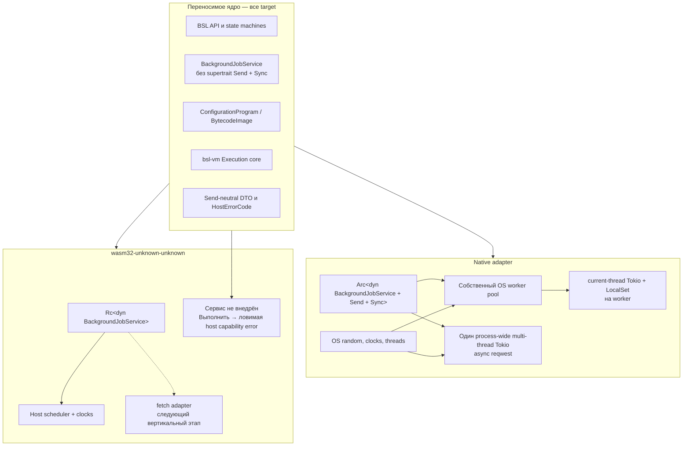
```mermaid
flowchart TB
    subgraph portable["Переносимое ядро — все target"]
        api["BSL API и state machines"]
        contract["BackgroundJobService<br/>без supertrait Send + Sync"]
        bytecode["ConfigurationProgram / BytecodeImage"]
        vm["bsl-vm Execution core"]
        dto["Send-neutral DTO и HostErrorCode"]
    end

    subgraph native["Native adapter"]
        arc["Arc&lt;dyn BackgroundJobService + Send + Sync&gt;"]
        pool["Собственный OS worker pool"]
        local["current-thread Tokio + LocalSet<br/>на worker"]
        http["Один process-wide multi-thread Tokio<br/>async reqwest"]
        os["OS random, clocks, threads"]
    end

    subgraph wasm["wasm32-unknown-unknown"]
    rc["Rc&lt;dyn BackgroundJobService&gt;"]
    host["Host scheduler + clocks"]
    fetch["fetch adapter<br/>следующий вертикальный этап"]
    missing["Сервис не внедрён<br/>Выполнить → ловимая host capability error"]
    end

    portable --> native
    portable --> wasm
    arc --> pool --> local
    arc --> http
    os --> pool
    os --> http
    rc --> host
    rc -.-> fetch
    portable --> missing
```

WASM собирает общую state machine, bytecode и API без нативного пула. `Future`,
`JoinHandle`, Tokio-типы и платформенные ошибки не входят в `bsl-rt`, bytecode
или публичные BSL-значения. Browser `fetch` не входит в 0.4.0, но его отсутствие
не меняет ABI.

## B. Конфигурация и bytecode

### ARCH-05 — Сборка конфигурации и entry

Файловая система остаётся ответственностью `bsl-cli`. Фасад принимает
не зависящий от файлов `ModuleGraphRecipe`; каталог замораживается до первого
`State` и до запуска job runtime.

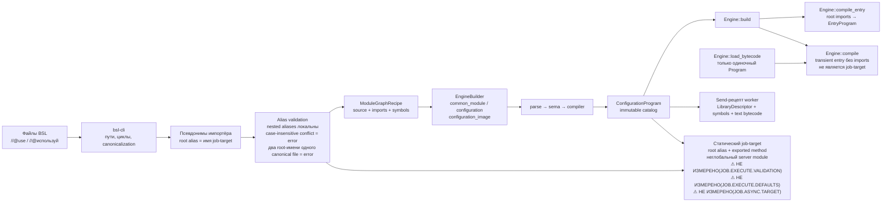
```mermaid
flowchart LR
    files["Файлы BSL<br/>//@use / //@используй"]
    scan["bsl-cli<br/>пути, циклы, canonicalization"]
    aliases["Псевдонимы импортёра<br/>root alias = имя job-target"]
    alias_validation["Alias validation<br/>nested aliases локальны<br/>case-insensitive conflict = error<br/>два root-имени одного canonical file = error"]
    recipe["ModuleGraphRecipe<br/>source + imports + symbols"]
    builder["EngineBuilder<br/>common_module / configuration<br/>configuration_image"]
    frontend["parse → sema → compiler"]
    catalog["ConfigurationProgram<br/>immutable catalog"]
    engine["Engine::build"]
    entry["Engine::compile_entry<br/>root imports → EntryProgram"]
    plain["Engine::compile<br/>transient entry без imports<br/>не является job-target"]
    load["Engine::load_bytecode<br/>только одиночный Program"]
    worker_recipe["Send-рецепт worker<br/>LibraryDescriptor + symbols + text bytecode"]
    target["Статический job-target<br/>root alias + exported method<br/>неглобальный server module<br/>⚠ НЕ ИЗМЕРЕНО(JOB.EXECUTE.VALIDATION)<br/>⚠ НЕ ИЗМЕРЕНО(JOB.EXECUTE.DEFAULTS)<br/>⚠ НЕ ИЗМЕРЕНО(JOB.ASYNC.TARGET)"]

    files --> scan --> aliases --> alias_validation --> recipe --> builder
    builder --> frontend --> catalog --> engine
    engine --> entry
    engine --> plain
    load --> plain
    catalog --> worker_recipe
    alias_validation --> target
    catalog --> target
```

Корневой псевдоним — стабильное имя общего модуля, поэтому
`ФоновыеЗадания.Выполнить("Псевдоним.Метод")` разрешается статически. Вложенный
псевдоним локален импортёру, пока тот же canonical file не подключён из корня.
Конфликт имён без учёта регистра и два корневых имени одного файла — ошибки.
Post-build `compile_linked` и позднее добавление общего модуля не вводятся.

### ARCH-06 — Bytecode image и link ABI

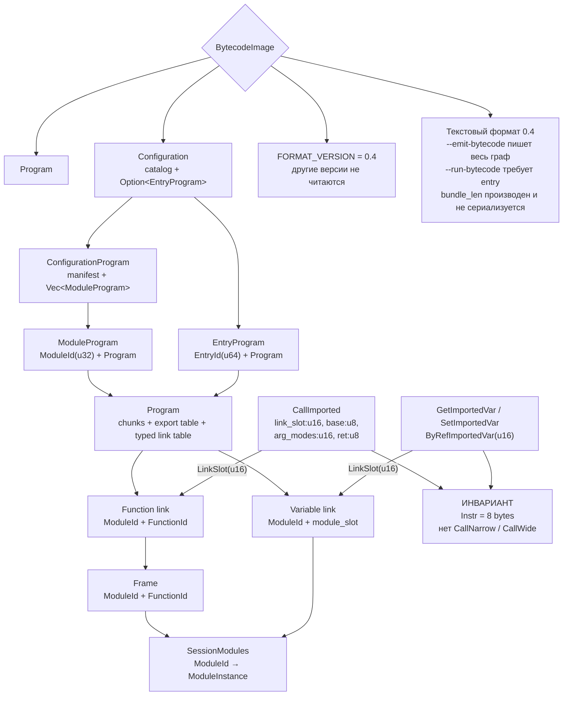
```mermaid
flowchart TB
    image{"BytecodeImage"}
    single["Program"]
    configuration["Configuration<br/>catalog + Option&lt;EntryProgram&gt;"]
    catalog["ConfigurationProgram<br/>manifest + Vec&lt;ModuleProgram&gt;"]
    module["ModuleProgram<br/>ModuleId(u32) + Program"]
    entry["EntryProgram<br/>EntryId(u64) + Program"]
    program["Program<br/>chunks + export table + typed link table"]
    function_link["Function link<br/>ModuleId + FunctionId"]
    variable_link["Variable link<br/>ModuleId + module_slot"]
    call_instr["CallImported<br/>link_slot:u16, base:u8,<br/>arg_modes:u16, ret:u8"]
    getset["GetImportedVar / SetImportedVar<br/>ByRefImportedVar(u16)"]
    frame["Frame<br/>ModuleId + FunctionId"]
    session["SessionModules<br/>ModuleId → ModuleInstance"]
    format["FORMAT_VERSION = 0.4<br/>другие версии не читаются"]
    width["ИНВАРИАНТ<br/>Instr = 8 bytes<br/>нет CallNarrow / CallWide"]
    listing["Текстовый формат 0.4<br/>--emit-bytecode пишет весь граф<br/>--run-bytecode требует entry<br/>bundle_len производен и не сериализуется"]

    image --> single
    image --> format
    image --> listing
    image --> configuration --> catalog
    configuration --> entry
    catalog --> module --> program
    entry --> program
    program --> function_link
    program --> variable_link
    call_instr -->|"LinkSlot(u16)"| function_link
    getset -->|"LinkSlot(u16)"| variable_link
    function_link --> frame --> session
    variable_link --> session
    call_instr --> width
    getset --> width
```

`ConfigurationId` — process-local идентичность Engine и не является
переносимым digest. `ModuleId` детерминирован позицией в manifest, `EntryId`
различает transient entry, а `LinkSlot(u16)` ограничивает один модуль 65 535
импортами. Worker проверяет готовый числовой manifest, но не повторяет
case-insensitive resolution.

`Instr` остаётся размером 8 байт. Логическая инструкция вызова одна;
`CallNarrow`/`CallWide` не вводятся. Narrow/wide-кодировка имеет смысл только
для отдельного будущего бинарного/mmap-представления после профиля памяти, а в
`Vec<Instr>` лишь дублировала бы VM, JIT и bundle-классификацию. Любой новый
opcode одновременно обновляет `write_instr`, parser, `OPCODES`, image
validation, effects, bundle verifier, round-trip corpus и `FORMAT_VERSION`.
Формат 0.4 не читает bytecode других версий; worker принимает каталог без
entry, а `--run-bytecode` требует entry.

### ARCH-07 — Сессионные модули и инициализация

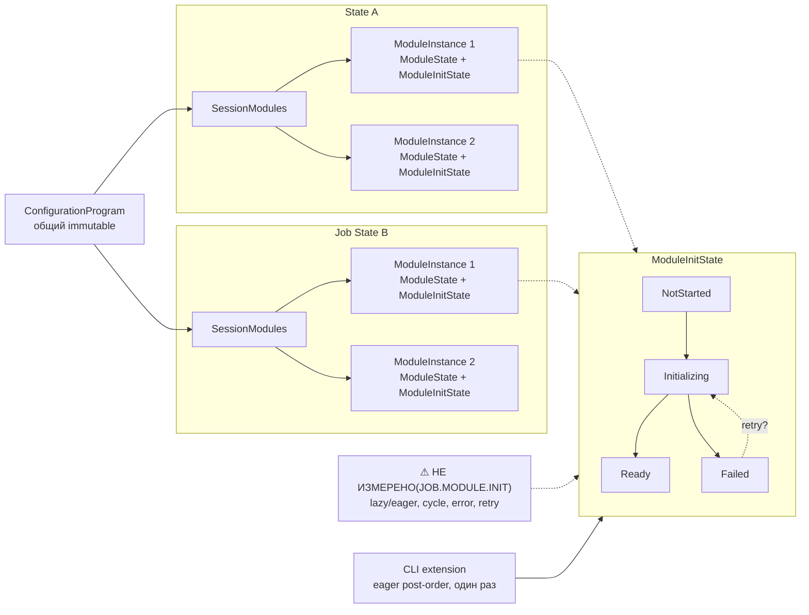
```mermaid
flowchart LR
    catalog["ConfigurationProgram<br/>общий immutable"]

    subgraph state_a["State A"]
        sessions_a["SessionModules"]
        a1["ModuleInstance 1<br/>ModuleState + ModuleInitState"]
        a2["ModuleInstance 2<br/>ModuleState + ModuleInitState"]
        sessions_a --> a1
        sessions_a --> a2
    end

    subgraph state_b["Job State B"]
        sessions_b["SessionModules"]
        b1["ModuleInstance 1<br/>ModuleState + ModuleInitState"]
        b2["ModuleInstance 2<br/>ModuleState + ModuleInitState"]
        sessions_b --> b1
        sessions_b --> b2
    end

    subgraph init["ModuleInitState"]
        not_started["NotStarted"] --> initializing["Initializing"]
        initializing --> ready["Ready"]
        initializing --> failed["Failed"]
        failed -.->|"retry?"| initializing
    end

    catalog --> sessions_a
    catalog --> sessions_b
    a1 -.-> init
    b1 -.-> init
    trigger["⚠ НЕ ИЗМЕРЕНО(JOB.MODULE.INIT)<br/>lazy/eager, cycle, error, retry"] -.-> init
    cli_init["CLI extension<br/>eager post-order, один раз"] --> init
```

CLI-расширение сохраняет eager post-order инициализацию файлового графа.
Серверный общий модуль job использует ту же state machine, но момент запуска и
retry определяет `JOB.MODULE.INIT`. Ни один `ModuleState` не переходит между
`State` или OS-потоками.

### ARCH-08 — Динамический код в конфигурации

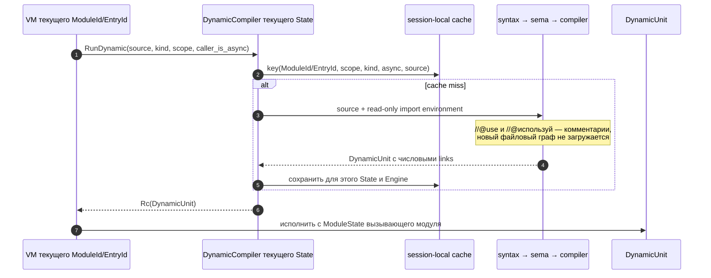
```mermaid
sequenceDiagram
    autonumber
    participant VM as VM текущего ModuleId/EntryId
    participant Dynamic as DynamicCompiler текущего State
    participant Cache as session-local cache
    participant Frontend as syntax → sema → compiler
    participant Unit as DynamicUnit

    VM->>Dynamic: RunDynamic(source, kind, scope, caller_is_async)
    Dynamic->>Cache: key(ModuleId/EntryId, scope, kind, async, source)
    alt cache miss
        Dynamic->>Frontend: source + read-only import environment
        Note over Frontend: //@use и //@используй — комментарии,<br/>новый файловый граф не загружается
        Frontend-->>Dynamic: DynamicUnit с числовыми links
        Dynamic->>Cache: сохранить для этого State и Engine
    end
    Dynamic-->>VM: Rc(DynamicUnit)
    VM->>Unit: исполнить с ModuleState вызывающего модуля
```

Ключ не содержит configuration fingerprint: Engine и symbols — инварианты
сессионного кэша. `Выполнить`/`Вычислить` видят read-only сигнатуры импортов и
переменные текущего модуля, но не получают прямой доступ к чужому
`ModuleState`.

## C. Исполнение

### ARCH-09 — Execution core, safe points и JIT

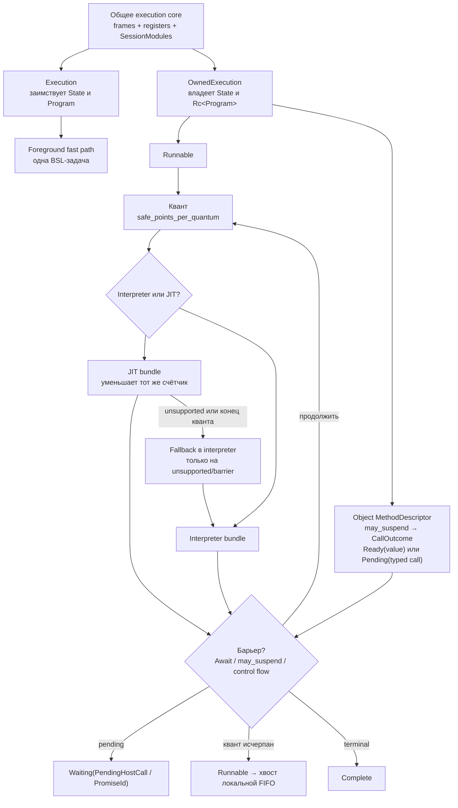
```mermaid
flowchart TD
    core["Общее execution core<br/>frames + registers + SessionModules"]
    borrowed["Execution<br/>заимствует State и Program"]
    owned["OwnedExecution<br/>владеет State и Rc&lt;Program&gt;"]
    runnable["Runnable"]
    quantum["Квант<br/>safe_points_per_quantum"]
    dispatch{"Interpreter или JIT?"}
    jit["JIT bundle<br/>уменьшает тот же счётчик"]
    interpreter["Interpreter bundle"]
    barrier{"Барьер?<br/>Await / may_suspend / control flow"}
    waiting["Waiting(PendingHostCall / PromiseId)"]
    tail["Runnable → хвост локальной FIFO"]
    complete["Complete"]
    fallback["Fallback в interpreter<br/>только на unsupported/barrier"]
    fast["Foreground fast path<br/>одна BSL-задача"]
    callout["Object MethodDescriptor<br/>may_suspend → CallOutcome<br/>Ready(value) или Pending(typed call)"]

    core --> borrowed
    core --> owned
    borrowed --> fast
    owned --> runnable --> quantum --> dispatch
    owned --> callout --> barrier
    dispatch --> jit --> barrier
    dispatch --> interpreter --> barrier
    jit -->|"unsupported или конец кванта"| fallback --> interpreter
    barrier -->|"pending"| waiting
    barrier -->|"квант исчерпан"| tail
    barrier -->|"terminal"| complete
    barrier -->|"продолжить"| quantum
```

`Await` и каждый descriptor с `may_suspend` являются барьерами VLIW-бандла.
Фоновый `OwnedExecution` всегда квантуется; обычный foreground `State` при одной
BSL-задаче сохраняет неограниченный быстрый путь. Фоновый квант — отдельная
ручка `background_safe_points_per_quantum`; отмена проверяется на каждом
safe point и от длины кванта не зависит. `State::run` остаётся
run-to-completion, а poolable owned API возвращает `Runnable`, `Waiting` или
`Complete`.

### ARCH-10 — Worker driver и пробуждения

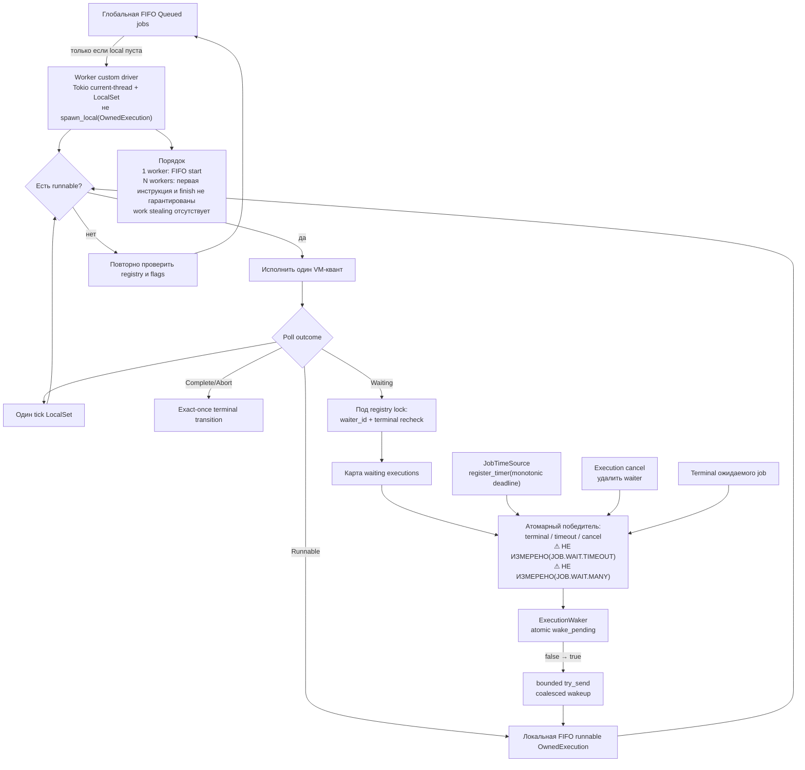
```mermaid
flowchart TD
    global["Глобальная FIFO Queued jobs"]
    start["Worker custom driver<br/>Tokio current-thread + LocalSet<br/>не spawn_local(OwnedExecution)"]
    local["Локальная FIFO runnable OwnedExecution"]
    waiting["Карта waiting executions"]
    pick{"Есть runnable?"}
    run["Исполнить один VM-квант"]
    outcome{"Poll outcome"}
    tick["Один tick LocalSet"]
    terminal["Exact-once terminal transition"]
    wake["ExecutionWaker<br/>atomic wake_pending"]
    channel["bounded try_send<br/>coalesced wakeup"]
    sleepcheck["Повторно проверить registry и flags"]
    register["Под registry lock:<br/>waiter_id + terminal recheck"]
    race["Атомарный победитель:<br/>terminal / timeout / cancel<br/>⚠ НЕ ИЗМЕРЕНО(JOB.WAIT.TIMEOUT)<br/>⚠ НЕ ИЗМЕРЕНО(JOB.WAIT.MANY)"]
    timer["JobTimeSource<br/>register_timer(monotonic deadline)"]
    cancel["Execution cancel<br/>удалить waiter"]
    observed_terminal["Terminal ожидаемого job"]
    ordering["Порядок<br/>1 worker: FIFO start<br/>N workers: первая инструкция и finish не гарантированы<br/>work stealing отсутствует"]

    global -->|"только если local пуста"| start
    start --> pick
    start --> ordering
    local --> pick
    pick -->|"да"| run --> outcome
    outcome -->|"Runnable"| local
    outcome -->|"Waiting"| register --> waiting
    outcome -->|"Complete/Abort"| terminal
    outcome --> tick --> pick
    waiting --> race --> wake -->|"false → true"| channel --> local
    timer --> race
    cancel --> race
    observed_terminal --> race
    pick -->|"нет"| sleepcheck --> global
```

Начатый execution закреплён за worker: `Rc<Program>`, `State` и `LocalSet` не
становятся `Send`. Work stealing нет; общая FIFO балансирует только ещё не
начатые jobs. Локальные futures обязаны быть кооперативными и не выполнять
блокирующий I/O. Заполненный wake-channel не теряет событие благодаря
`wake_pending` и повторной проверке перед сном. Сон worker — `block_on` над
`select` из wake-канала и ближайшего deadline `JobTimeSource` внутри его
runtime, поэтому таймеры срабатывают и в простое; голый park вне runtime
запрещён.

### ARCH-11 — Синхронный и асинхронный HTTP из job

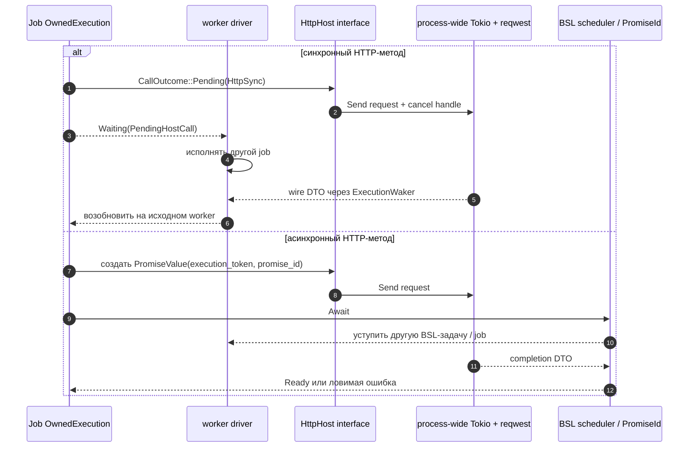
```mermaid
sequenceDiagram
    autonumber
    participant BSL as Job OwnedExecution
    participant Worker as worker driver
    participant Host as HttpHost interface
    participant HTTP as process-wide Tokio + reqwest
    participant Promise as BSL scheduler / PromiseId

    alt синхронный HTTP-метод
        BSL->>Host: CallOutcome::Pending(HttpSync)
        Host->>HTTP: Send request + cancel handle
        BSL-->>Worker: Waiting(PendingHostCall)
        Worker->>Worker: исполнять другой job
        HTTP-->>Worker: wire DTO через ExecutionWaker
        Worker-->>BSL: возобновить на исходном worker
    else асинхронный HTTP-метод
        BSL->>Host: создать PromiseValue(execution_token, promise_id)
        Host->>HTTP: Send request
        BSL->>Promise: Await
        Promise-->>Worker: уступить другую BSL-задачу / job
        HTTP-->>Promise: completion DTO
        Promise-->>BSL: Ready или ловимая ошибка
    end
```

Tokio `Future`, `JoinHandle` и ошибки транспорта не входят в VM или BSL.
`PromiseValue` остаётся непрозрачным `BslObject::Extension`; token закрывается
при завершении run и запрещает ждать promise другого execution. Отмена
execution отменяет активный host-handle, а поздний completion проверяет
`execution_token + pending_call_id`. HTTP-runtime чисто I/O-bound: число его
потоков фиксируется малым и не масштабируется числом CPU, чтобы не
пересподписывать ядра против пула воркеров.

### ARCH-12 — Вложенное фоновое задание

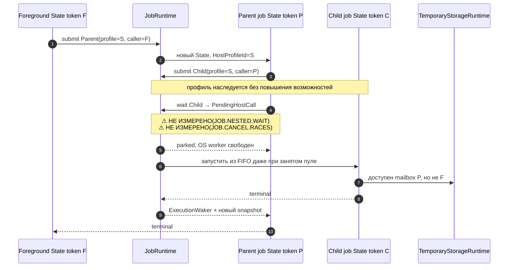
```mermaid
sequenceDiagram
    autonumber
    participant Foreground as Foreground State token F
    participant Runtime as JobRuntime
    participant Parent as Parent job State token P
    participant Child as Child job State token C
    participant Storage as TemporaryStorageRuntime

    Foreground->>Runtime: submit Parent(profile=S, caller=F)
    Runtime->>Parent: новый State, HostProfileId=S
    Parent->>Runtime: submit Child(profile=S, caller=P)
    Note over Runtime,Child: профиль наследуется без повышения возможностей
    Parent->>Runtime: wait Child → PendingHostCall
    Note over Parent,Runtime: ⚠ НЕ ИЗМЕРЕНО(JOB.NESTED.WAIT)<br/>⚠ НЕ ИЗМЕРЕНО(JOB.CANCEL.RACES)
    Runtime-->>Parent: parked, OS worker свободен
    Runtime->>Child: запустить из FIFO даже при занятом пуле
    Child->>Storage: доступен mailbox P, но не F
    Child-->>Runtime: terminal
    Runtime-->>Parent: ExecutionWaker + новый snapshot
    Parent-->>Foreground: terminal
```

Ожидание ребёнка не блокирует OS worker, поэтому два родителя при полностью
занятом пуле могут породить и дождаться детей. Транзитивного повышения
temporary-storage capability нет. Связывать отмену parent и child до замера
нельзя: `⚠ НЕ ИЗМЕРЕНО(JOB.CANCEL.RACES)`.

## D. Lifecycle

### ARCH-13 — Состояния JobRuntime

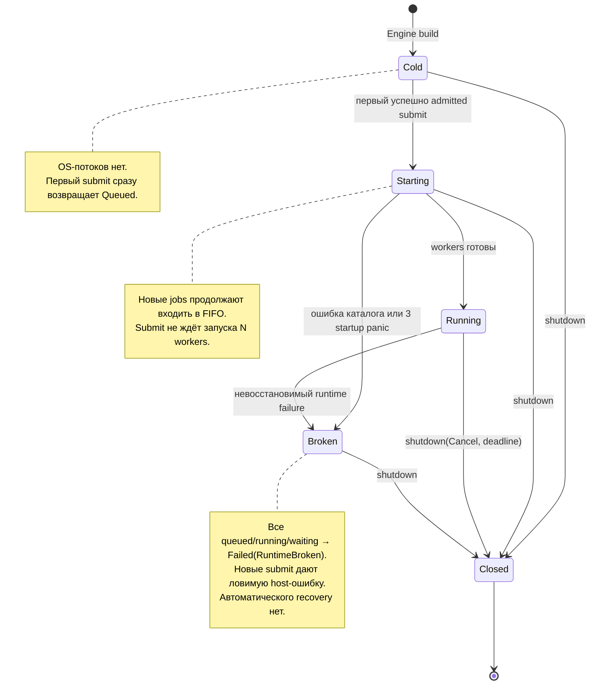
```mermaid
stateDiagram-v2
    [*] --> Cold: Engine build
    Cold --> Starting: первый успешно admitted submit
    Starting --> Running: workers готовы
    Starting --> Broken: ошибка каталога или 3 startup panic
    Running --> Broken: невосстановимый runtime failure
    Cold --> Closed: shutdown
    Starting --> Closed: shutdown
    Running --> Closed: shutdown(Cancel, deadline)
    Broken --> Closed: shutdown
    Closed --> [*]

    note right of Cold
        OS-потоков нет.
        Первый submit сразу возвращает Queued.
    end note
    note right of Starting
        Новые jobs продолжают входить в FIFO.
        Submit не ждёт запуска N workers.
    end note
    note right of Broken
        Все queued/running/waiting → Failed(RuntimeBroken).
        Новые submit дают ловимую host-ошибку.
        Автоматического recovery нет.
    end note
```

Занятость всех workers не меняет состояние runtime и всегда означает очередь.
Отказать до admission можно из-за неверного вызова, дублирующего ключа,
закрытого/сломанного runtime или явного ресурсного лимита.

### ARCH-14 — Job lifecycle и BSL-снимок

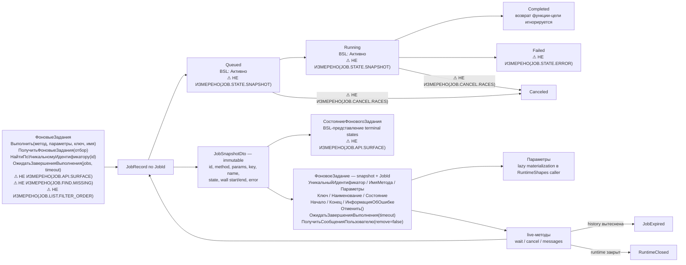
```mermaid
flowchart LR
    manager["ФоновыеЗадания<br/>Выполнить(метод, параметры, ключ, имя)<br/>ПолучитьФоновыеЗадания(отбор)<br/>НайтиПоУникальномуИдентификатору(id)<br/>ОжидатьЗавершенияВыполнения(jobs, timeout)<br/>⚠ НЕ ИЗМЕРЕНО(JOB.API.SURFACE)<br/>⚠ НЕ ИЗМЕРЕНО(JOB.FIND.MISSING)<br/>⚠ НЕ ИЗМЕРЕНО(JOB.LIST.FILTER_ORDER)"]
    registry["JobRecord по JobId"]
    queued["Queued<br/>BSL: Активно<br/>⚠ НЕ ИЗМЕРЕНО(JOB.STATE.SNAPSHOT)"]
    running["Running<br/>BSL: Активно<br/>⚠ НЕ ИЗМЕРЕНО(JOB.STATE.SNAPSHOT)"]
    completed["Completed<br/>возврат функции-цели игнорируется"]
    failed["Failed<br/>⚠ НЕ ИЗМЕРЕНО(JOB.STATE.ERROR)"]
    canceled["Canceled"]
    snapshot["JobSnapshotDto — immutable<br/>id, method, params, key, name,<br/>state, wall start/end, error"]
    object["ФоновоеЗадание — snapshot + JobId<br/>УникальныйИдентификатор / ИмяМетода / Параметры<br/>Ключ / Наименование / Состояние<br/>Начало / Конец / ИнформацияОбОшибке<br/>Отменить()<br/>ОжидатьЗавершенияВыполнения(timeout)<br/>ПолучитьСообщенияПользователю(remove=false)"]
    state_enum["СостояниеФоновогоЗадания<br/>BSL-представление terminal states<br/>⚠ НЕ ИЗМЕРЕНО(JOB.API.SURFACE)"]
    params["Параметры<br/>lazy materialization в RuntimeShapes caller"]
    live["live-методы<br/>wait / cancel / messages"]
    expired["JobExpired"]
    closed["RuntimeClosed"]

    manager --> registry --> queued --> running
    running --> completed
    running --> failed
    running -->|"⚠ НЕ ИЗМЕРЕНО(JOB.CANCEL.RACES)"| canceled
    queued -->|"⚠ НЕ ИЗМЕРЕНО(JOB.CANCEL.RACES)"| canceled
    registry --> snapshot --> object
    snapshot --> state_enum
    object --> params
    object --> live --> registry
    live -->|"history вытеснена"| expired
    live -->|"runtime закрыт"| closed
```

Первый terminal transition выигрывает, освобождает key/admission reservations и
будит waiters. Старый объект не обновляет свойства: поиск и ожидание создают
новый `JobSnapshotDto`. Уже материализованные свойства читаются после eviction
или shutdown, а live-методы различают `JobExpired` и `RuntimeClosed`.
Возвращаемое значение функции-цели игнорируется. Точная BSL-поверхность,
арности, defaults и английские aliases — `⚠ НЕ ИЗМЕРЕНО(JOB.API.SURFACE)`.

### ARCH-15 — Worker failure и replacement

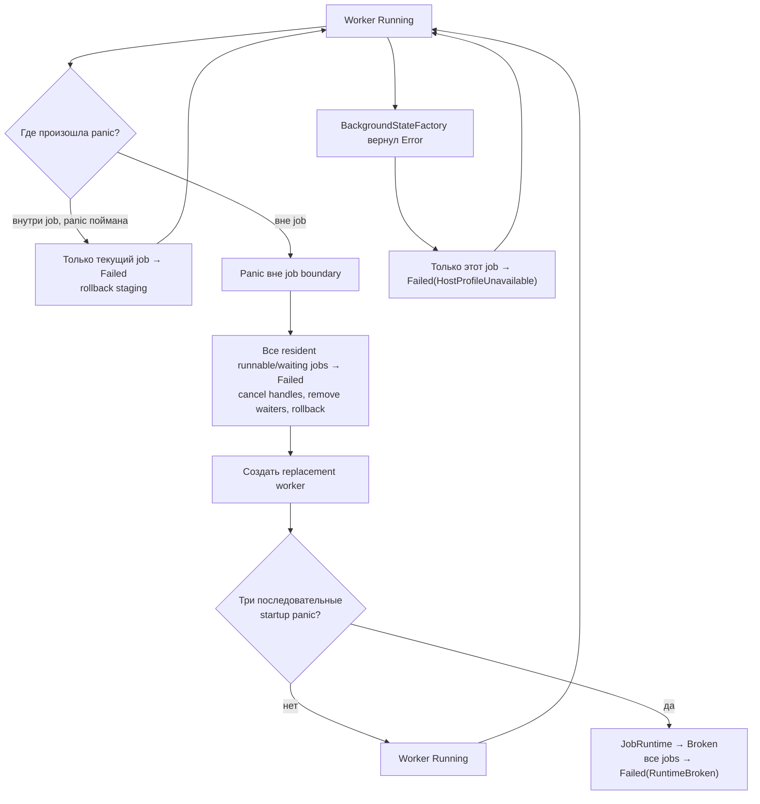
```mermaid
flowchart TD
    worker["Worker Running"]
    job_boundary{"Где произошла panic?"}
    job_failed["Только текущий job → Failed<br/>rollback staging"]
    worker_panic["Panic вне job boundary"]
    residents["Все resident runnable/waiting jobs → Failed<br/>cancel handles, remove waiters, rollback"]
    replace["Создать replacement worker"]
    startup{"Три последовательные<br/>startup panic?"}
    recovered["Worker Running"]
    broken["JobRuntime → Broken<br/>все jobs → Failed(RuntimeBroken)"]
    factory["BackgroundStateFactory вернул Error"]
    profile_failed["Только этот job → Failed(HostProfileUnavailable)"]

    worker --> job_boundary
    job_boundary -->|"внутри job, panic поймана"| job_failed --> worker
    job_boundary -->|"вне job"| worker_panic --> residents --> replace --> startup
    startup -->|"нет"| recovered --> worker
    startup -->|"да"| broken
    worker --> factory --> profile_failed --> worker
```

Registry lock не удерживается во время фабрики, исполнения, сериализации,
материализации или отмены host-handle. Ошибка фабрики без panic не повреждает
worker или соседние jobs.

### ARCH-16 — Shutdown, deadline и detached worker

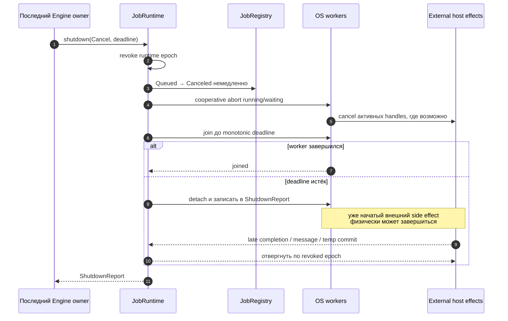
```mermaid
sequenceDiagram
    autonumber
    participant Owner as Последний Engine owner
    participant Runtime as JobRuntime
    participant Registry as JobRegistry
    participant Workers as OS workers
    participant Host as External host effects

    Owner->>Runtime: shutdown(Cancel, deadline)
    Runtime->>Runtime: revoke runtime epoch
    Runtime->>Registry: Queued → Canceled немедленно
    Runtime->>Workers: cooperative abort running/waiting
    Workers->>Host: cancel активных handles, где возможно
    Runtime->>Workers: join до monotonic deadline
    alt worker завершился
        Workers-->>Runtime: joined
    else deadline истёк
        Runtime->>Workers: detach и записать в ShutdownReport
        Note over Workers,Host: уже начатый внешний side effect<br/>физически может завершиться
        Host-->>Runtime: late completion / message / temp commit
        Runtime-->>Host: отвергнуть по revoked epoch
    end
    Runtime-->>Owner: ShutdownReport
```

`Drop` посылает отмену, но не блокируется бесконечно. Epoch запрещает новые
enqueue и публикации, но уже принятое host-очередью сообщение может появиться в
stdout/UI после shutdown. API не обещает остановить внешний side effect после
deadline.

### ARCH-17 — Ошибки, отмена и terminal publication

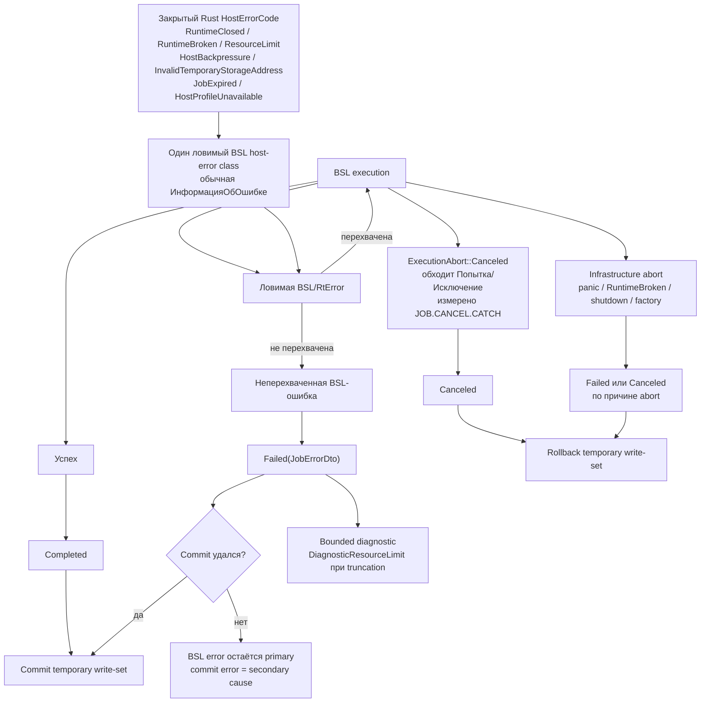
```mermaid
flowchart TD
    execution["BSL execution"]
    success["Успех"]
    bsl_error["Ловимая BSL/RtError"]
    uncaught["Неперехваченная BSL-ошибка"]
    cancel["ExecutionAbort::Canceled<br/>обходит Попытка/Исключение<br/>измерено JOB.CANCEL.CATCH"]
    infra["Infrastructure abort<br/>panic / RuntimeBroken / shutdown / factory"]
    completed["Completed"]
    failed_bsl["Failed(JobErrorDto)"]
    canceled["Canceled"]
    failed_infra["Failed или Canceled<br/>по причине abort"]
    commit["Commit temporary write-set"]
    rollback["Rollback temporary write-set"]
    commit_error{"Commit удался?"}
    primary["BSL error остаётся primary<br/>commit error = secondary cause"]
    diagnostic["Bounded diagnostic<br/>DiagnosticResourceLimit при truncation"]
    host_class["Один ловимый BSL host-error class<br/>обычная ИнформацияОбОшибке"]
    host_codes["Закрытый Rust HostErrorCode<br/>RuntimeClosed / RuntimeBroken / ResourceLimit<br/>HostBackpressure / InvalidTemporaryStorageAddress<br/>JobExpired / HostProfileUnavailable"]

    execution --> success --> completed --> commit
    execution --> bsl_error -->|"перехвачена"| execution
    bsl_error -->|"не перехвачена"| uncaught --> failed_bsl --> commit_error
    commit_error -->|"да"| commit
    commit_error -->|"нет"| primary
    failed_bsl --> diagnostic
    execution --> cancel --> canceled --> rollback
    execution --> infra --> failed_infra --> rollback
    host_codes --> host_class --> bsl_error
```

Замер `JOB.CANCEL.CATCH` закрепляет отмену как не-BSL-исключение. Все ошибки
host-возможности представлены одним BSL-классом и обычной
`ИнформацияОбОшибке`; Rust различает закрытый `HostErrorCode`, включая
`RuntimeClosed`, `RuntimeBroken`, `ResourceLimit`, `HostBackpressure`,
`InvalidTemporaryStorageAddress`, `JobExpired` и `HostProfileUnavailable`.
Полный diagnostic ограничен `max_error_bytes_per_job` и не может обойти общий
memory budget.

## E. Данные и host-эффекты

### ARCH-18 — DTO и межпоточная граница

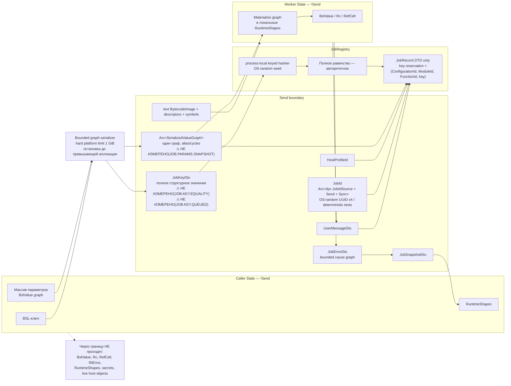
```mermaid
flowchart LR
    subgraph caller["Caller State — !Send"]
        params["Массив параметров<br/>BslValue graph"]
        key["BSL-ключ"]
        shapes["RuntimeShapes"]
    end

    serializer["Bounded graph serializer<br/>hard platform limit 1 GiB<br/>остановка до превышающей аллокации"]

    subgraph boundary["Send boundary"]
        graph_dto["Arc&lt;SerializedValueGraph&gt;<br/>один граф, alias/cycles<br/>⚠ НЕ ИЗМЕРЕНО(JOB.PARAMS.SNAPSHOT)"]
        keydto["JobKeyDto<br/>полное структурное значение<br/>⚠ НЕ ИЗМЕРЕНО(JOB.KEY.EQUALITY)<br/>⚠ НЕ ИЗМЕРЕНО(JOB.KEY.QUEUED)"]
        profile["HostProfileId"]
        recipe["text BytecodeImage + descriptors + symbols"]
        errordto["JobErrorDto<br/>bounded cause graph"]
        msgdto["UserMessageDto"]
        snapshot["JobSnapshotDto"]
        jobid["JobId<br/>Arc&lt;dyn JobIdSource + Send + Sync&gt;<br/>OS-random UUID v4 / deterministic tests"]
    end

    subgraph registry["JobRegistry"]
        hasher["process-local keyed hasher<br/>OS-random seed"]
        equality["Полное равенство — авторитетное"]
        record["JobRecord DTO only<br/>key reservation =<br/>(ConfigurationId, ModuleId, FunctionId, key)"]
    end

    subgraph worker["Worker State — !Send"]
        materialize["Materialize graph<br/>в локальные RuntimeShapes"]
        local["BslValue / Rc / RefCell"]
    end

    params --> serializer --> graph_dto
    key --> serializer --> keydto
    graph_dto --> record
    keydto --> hasher --> equality --> record
    profile --> record
    jobid --> record
    recipe --> worker
    graph_dto --> materialize --> local
    worker --> errordto --> snapshot --> shapes
    worker --> msgdto --> record

    forbidden["Через границу НЕ проходят:<br/>BslValue, Rc, RefCell, RtError,<br/>RuntimeShapes, secrets, live host objects"]
    caller -.-> forbidden
```

Параметры сериализуются одним графом и декодируются лениво при первом чтении
свойства `Параметры`, после чего кэшируются только в вызывающем `State`.
Сохранение alias/cycles и точный момент snapshot подтверждает
`⚠ НЕ ИЗМЕРЕНО(JOB.PARAMS.SNAPSHOT)`. Digest ключа не сериализуется и не
является BSL-контрактом; совпадение hash всегда проверяется полным структурным
равенством. Тесты внедряют детерминированные источники ID и hash seed.

### ARCH-19 — Admission, бюджеты и история

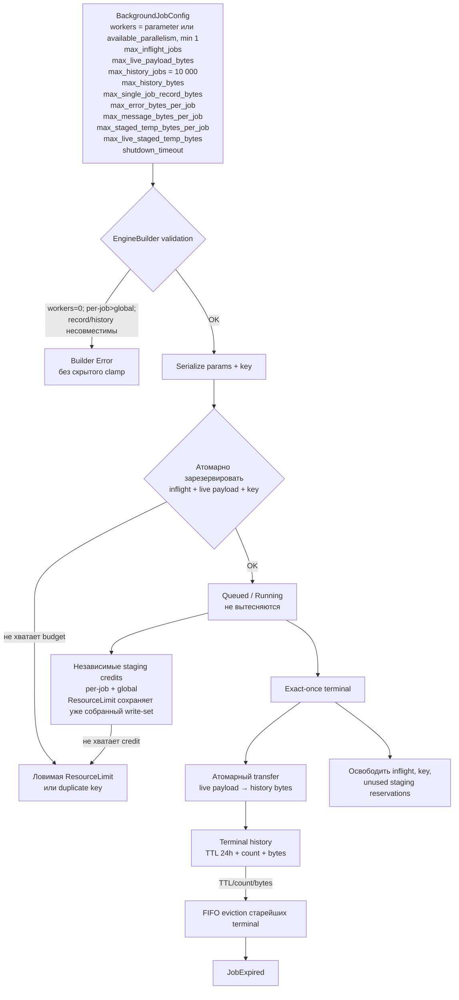
```mermaid
flowchart TD
    config["BackgroundJobConfig<br/>workers = parameter или available_parallelism, min 1<br/>max_inflight_jobs<br/>max_live_payload_bytes<br/>max_history_jobs = 10 000<br/>max_history_bytes<br/>max_single_job_record_bytes<br/>max_error_bytes_per_job<br/>max_message_bytes_per_job<br/>max_staged_temp_bytes_per_job<br/>max_live_staged_temp_bytes<br/>shutdown_timeout"]
    validate{"EngineBuilder validation"}
    invalid["Builder Error<br/>без скрытого clamp"]
    submit["Serialize params + key"]
    reserve{"Атомарно зарезервировать<br/>inflight + live payload + key"}
    reject["Ловимая ResourceLimit<br/>или duplicate key"]
    queued["Queued / Running<br/>не вытесняются"]
    staging["Независимые staging credits<br/>per-job + global<br/>ResourceLimit сохраняет уже собранный write-set"]
    terminal["Exact-once terminal"]
    transfer["Атомарный transfer<br/>live payload → history bytes"]
    history["Terminal history<br/>TTL 24h + count + bytes"]
    evict["FIFO eviction старейших terminal"]
    expired["JobExpired"]
    release["Освободить inflight, key,<br/>unused staging reservations"]

    config --> validate
    validate -->|"workers=0; per-job>global;<br/>record/history несовместимы"| invalid
    validate -->|"OK"| submit --> reserve
    reserve -->|"не хватает budget"| reject
    reserve -->|"OK"| queued
    queued --> staging
    staging -->|"не хватает credit"| reject
    queued --> terminal --> transfer --> history
    terminal --> release
    history -->|"TTL/count/bytes"| evict --> expired
```

Занятый worker не является admission error. Запись, которая максимально может
превысить `max_single_job_record_bytes`, отвергается заранее; terminal transfer
не учитывает payload дважды. История намеренно расширена относительно 1С до
10 000 jobs, но всегда ограничена также байтами.
Terminal-записи неизменяемы и хранятся как `Arc`: листинг клонирует
указатели под локом и фильтрует вне его; вытеснение амортизировано на
добавлении, TTL проверяется лениво при добавлении и чтении.
Отбор первых 10 000 записей линейный; индекс и отдельный лок
истории добавляются только после профиля.

### ARCH-20 — Временное хранилище: capability и публикация

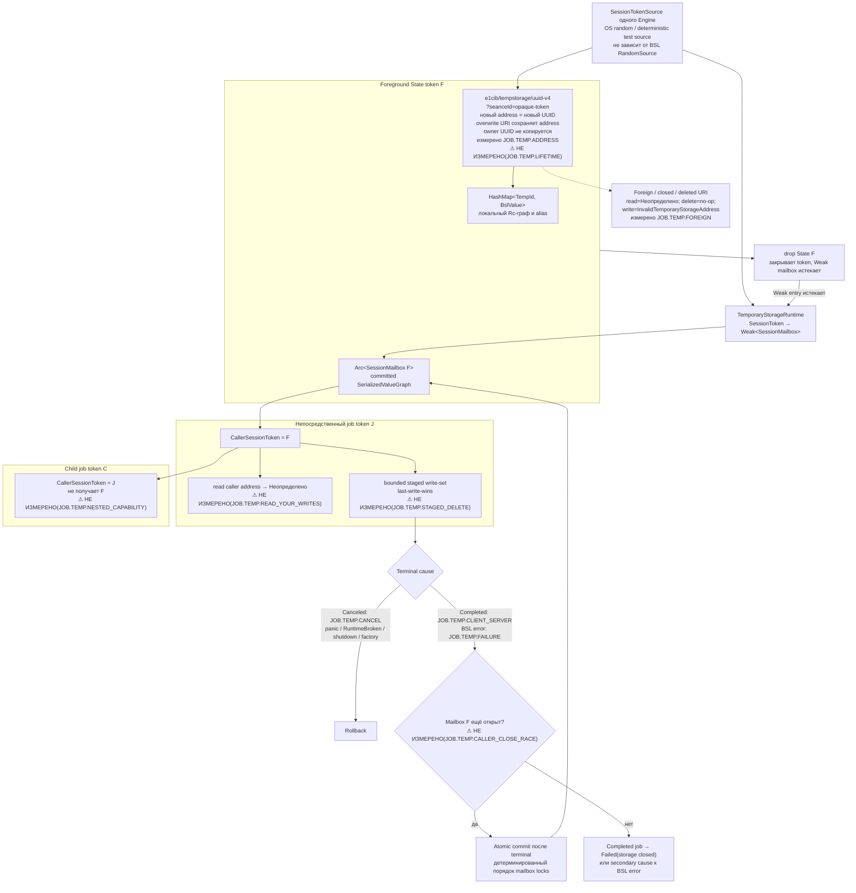
```mermaid
flowchart TB
    source["SessionTokenSource одного Engine<br/>OS random / deterministic test source<br/>не зависит от BSL RandomSource"]
    runtime["TemporaryStorageRuntime<br/>SessionToken → Weak&lt;SessionMailbox&gt;"]

    subgraph owner["Foreground State token F"]
        local["HashMap&lt;TempId, BslValue&gt;<br/>локальный Rc-граф и alias"]
        mailbox["Arc&lt;SessionMailbox F&gt;<br/>committed SerializedValueGraph"]
        address["e1cib/tempstorage/uuid-v4<br/>?seanceId=opaque-token<br/>новый address = новый UUID<br/>overwrite URI сохраняет address<br/>owner UUID не копируется<br/>измерено JOB.TEMP.ADDRESS<br/>⚠ НЕ ИЗМЕРЕНО(JOB.TEMP.LIFETIME)"]
    end

    subgraph job["Непосредственный job token J"]
        caller_cap["CallerSessionToken = F"]
        read["read caller address → Неопределено<br/>⚠ НЕ ИЗМЕРЕНО(JOB.TEMP.READ_YOUR_WRITES)"]
        writes["bounded staged write-set<br/>last-write-wins<br/>⚠ НЕ ИЗМЕРЕНО(JOB.TEMP.STAGED_DELETE)"]
    end

    subgraph child["Child job token C"]
        child_cap["CallerSessionToken = J<br/>не получает F<br/>⚠ НЕ ИЗМЕРЕНО(JOB.TEMP.NESTED_CAPABILITY)"]
    end

    terminal{"Terminal cause"}
    publish["Atomic commit после terminal<br/>детерминированный порядок mailbox locks"]
    rollback["Rollback"]
    closed{"Mailbox F ещё открыт?<br/>⚠ НЕ ИЗМЕРЕНО(JOB.TEMP.CALLER_CLOSE_RACE)"}
    failed["Completed job → Failed(storage closed)<br/>или secondary cause к BSL error"]
    foreign["Foreign / closed / deleted URI<br/>read=Неопределено; delete=no-op;<br/>write=InvalidTemporaryStorageAddress<br/>измерено JOB.TEMP.FOREIGN"]
    drop["drop State F<br/>закрывает token, Weak mailbox истекает"]

    source --> runtime --> mailbox
    source --> address --> local
    mailbox --> caller_cap
    caller_cap --> read
    caller_cap --> writes
    writes --> terminal
    terminal -->|"Completed: JOB.TEMP.CLIENT_SERVER<br/>BSL error: JOB.TEMP.FAILURE"| closed
    terminal -->|"Canceled: JOB.TEMP.CANCEL<br/>panic / RuntimeBroken / shutdown / factory"| rollback
    closed -->|"да"| publish --> mailbox
    closed -->|"нет"| failed
    caller_cap --> child_cap
    address -.-> foreign
    owner --> drop -->|"Weak entry истекает"| runtime
```

Обычные операции одного `State` не сериализуют локальный граф. Job может
stage-write только mailbox непосредственного caller; строка URI сама по себе не
повышает capability. До terminal transition родитель видит старое значение.
Измеренный клиент-серверный контракт выбирается намеренно; ранняя видимость
файловой базы 1С не повторяется. Commit выполняется после успеха и
неперехваченной BSL-ошибки, rollback — после отмены и инфраструктурного abort.
Частичная публикация нескольких адресов запрещена.

Следующие связи остаются помеченными до замера: read-your-writes
`JOB.TEMP.READ_YOUR_WRITES`, staged delete `JOB.TEMP.STAGED_DELETE`, nested
capability `JOB.TEMP.NESTED_CAPABILITY`, lifetime/reuse `JOB.TEMP.LIFETIME` и
caller-close race `JOB.TEMP.CALLER_CLOSE_RACE`. Измеренный foreign-контракт —
`JOB.TEMP.FOREIGN`, commit ошибки — `JOB.TEMP.FAILURE`, rollback отмены —
`JOB.TEMP.CANCEL`.

### ARCH-21 — Сообщения пользователю

```mermaid
sequenceDiagram
    autonumber
    participant BSL as Сообщить и СообщениеПользователю
    participant Format as bsl-format
    participant Registry as JobRegistry message history
    participant Sink as UserMessageSink
    participant Host as bsl-cli stdout queue / другой host
    participant Reader as ПолучитьСообщенияПользователю

    Note over BSL: ⚠ НЕ ИЗМЕРЕНО(JOB.MESSAGES)
    BSL->>Format: format_value, не BslValue::Display
    Format-->>BSL: UserMessageDto
    alt вызов внутри job
        BSL->>Registry: добавить DTO с JobId в FIFO history
        Registry-->>BSL: registry lock освобождён
    end
    BSL->>Sink: enqueue(DTO), неблокирующий
    alt accepted
        Sink-->>Host: host решает представление
        Note over Sink,Host: принятое DTO может отобразиться после shutdown
    else backpressure
        Sink-->>BSL: ловимая HostBackpressure
        Note over Registry: сообщение остаётся в истории, скрытого retry нет
    end
    Reader->>Registry: read или atomic drain FIFO-prefix
    Registry-->>Reader: live/terminal messages
```

Глобальный `Сообщить` использует тот же DTO-путь без промежуточного BSL-объекта.
В foreground сообщение идёт прямо в sink; в job сначала сохраняется совместимая
история. Форматирование и enqueue никогда не выполняются под registry lock.
Порядок одного job — FIFO, порядок разных jobs не обещается. Бюджет сообщений
отделён от diagnostic и staging budgets, но входит в размер history record.
Точная BSL-модель сообщения, live-read и drain проверяются
`⚠ НЕ ИЗМЕРЕНО(JOB.MESSAGES)`.

## F. Нормативные расхождения и трассировка

### Намеренные решения open-bsl

| Решение | Где видно | Статус |
|---|---|---|
| История ограничена 10 000 jobs, а не документированными 1 000 у 1С | `ARCH-19` | Намеренное расширение |
| Временное хранилище следует клиент-серверной семантике 1С | `ARCH-20` | Измерено на 8.3.27.2342 |
| Ранняя видимость записи в файловой базе не повторяется | `ARCH-20` | Намеренное расхождение |
| Отмена job не является ловимой BSL-ошибкой | `ARCH-17` | Измерено `JOB.CANCEL.CATCH` |
| Регламентные задания и планировщик не входят в 0.4.0 | `ARCH-01` | Отложено |
| Пользователи, права, информационные базы и журнал не моделируются | `ARCH-01` | Отложено |
| Browser `fetch` не реализуется вместе с native runtime | `ARCH-04` | Следующий WASM-этап |
| Формат 0.4 не поддерживает старые версии bytecode | `ARCH-06` | Принято |
| Единый `CallImported`, без Narrow/Wide-дублирования | `ARCH-06` | Принято |

### Трассировка разделов плана

| Раздел `bsl-background-jobs.md` | Нормативные диаграммы | Покрытие |
|---|---|---|
| Границы версии 0.4.0 | `ARCH-01`, `ARCH-04`, `ARCH-19` | Включённые и отложенные механизмы, переносимость, история 10 000 |
| Связь с планом подключения модулей | `ARCH-05`–`ARCH-08` | CLI-граф, builder-first API, aliases, imports, dynamic code |
| Архитектурные инварианты | `ARCH-02`–`ARCH-04`, `ARCH-18` | Владение, запрет зависимостей, изоляция Engine/State и DTO-граница |
| Пул, Tokio и планирование | `ARCH-03`, `ARCH-09`, `ARCH-10`, `ARCH-13`, `ARCH-15` | Ленивый пул, pinned execution, кванты, wakeup, failure/replacement |
| Переносимый host-контракт | `ARCH-02`, `ARCH-04`, `ARCH-11`, `ARCH-17` | Native/WASM binding, отсутствие Tokio в ABI, host errors |
| BSL-поверхность и снимки | `ARCH-14`, `ARCH-18`, `ARCH-21` | Manager API, immutable snapshots, lazy params, сообщения |
| Каталог общих модулей и bytecode | `ARCH-05`–`ARCH-08` | `ConfigurationProgram`, image, links, init и dynamic cache |
| Владеющий execution и приостановка VM | `ARCH-09`–`ARCH-12` | Owned API, safe points, pending calls, HTTP и nested wait |
| Параметры, ключ и ошибки | `ARCH-17`–`ARCH-19` | Graph DTO, keyed index, bounded diagnostic и budgets |
| Admission, лимиты и история | `ARCH-13`, `ARCH-14`, `ARCH-19` | Admission, exact-once terminal, transfer и eviction |
| Временное хранилище | `ARCH-03`, `ARCH-12`, `ARCH-17`, `ARCH-20` | Engine-local ownership, capability, terminal commit/rollback |
| Сообщения пользователю | `ARCH-17`, `ARCH-19`, `ARCH-21` | History, byte budget, enqueue, backpressure и shutdown |
| Зафиксированные замеры 1С | `ARCH-14`, `ARCH-17`, `ARCH-20` | Выведенные контракты без копирования сырого вывода |
| Порядок реализации | `ARCH-01`–`ARCH-21` | Этапы остаются в плане; диаграммы задают конечные границы этапов |
| Нагрузочные и регрессионные проверки | `ARCH-10`, `ARCH-12`, `ARCH-19` | Fan-out, nested wait, lazy threads, budgets и history scale |
| Критерии готовности | `ARCH-01`–`ARCH-21` | Полное целевое состояние 0.4.0 |

### Трассировка неизмеренных контрактов

| Группа замеров | Диаграммы | Что может измениться после замера |
|---|---|---|
| `JOB.API.SURFACE`, `JOB.EXECUTE.VALIDATION`, `JOB.EXECUTE.DEFAULTS` | `ARCH-05`, `ARCH-14` | Сигнатуры, defaults и validation цели |
| `JOB.PARAMS.SNAPSHOT` | `ARCH-18` | Момент копирования, alias/cycles и unsupported values |
| `JOB.KEY.*` | `ARCH-18`, `ARCH-19` | Канонизация, структурное равенство и участие queued job |
| `JOB.STATE.SNAPSHOT`, `JOB.STATE.ERROR` | `ARCH-14`, `ARCH-17` | BSL-отображение состояний, timestamps и error fields |
| `JOB.WAIT.TIMEOUT`, `JOB.WAIT.MANY` | `ARCH-09`, `ARCH-10`, `ARCH-14` | Timeout units/races и any/all для массива |
| `JOB.CANCEL.RACES` | `ARCH-12`, `ARCH-14`, `ARCH-17` | Parent/child и repeated/terminal race |
| `JOB.FIND.MISSING`, `JOB.LIST.FILTER_ORDER` | `ARCH-14`, `ARCH-19` | Missing UUID и порядок/семантика отбора |
| `JOB.MODULE.INIT` | `ARCH-07` | Триггер, цикл, ошибка и retry |
| `JOB.NESTED.WAIT`, `JOB.ASYNC.TARGET` | `ARCH-11`, `ARCH-12`, `ARCH-14` | Критерий завершения async-цели и nested wait |
| `JOB.MESSAGES` | `ARCH-21` | Поля DTO, live-read и drain |
| `JOB.TEMP.*` | `ARCH-12`, `ARCH-20` | Lifetime, read-your-writes, delete, nested capability и close race |

### Неподвижные архитектурные инварианты

1. Один job — один изолированный `State`; программы worker-local, каталог
   Engine неизменяем.
2. `JobRegistry` хранит только владеющие DTO и никогда не вызывает внешний код
   под своим lock; его мьютекс — синхронный `std::sync::Mutex`, не
   пересекающий `await`.
3. Занятый пул означает FIFO, а не ошибку; resource limits применяются до или
   во время явно показанного reservation.
4. `OwnedExecution` закреплён за worker, но pending host call освобождает worker
   для другого сеанса.
5. Worker-local Tokio и process-wide HTTP Tokio имеют разные обязанности и не
   обмениваются Rust futures.
6. Все поздние результаты проверяют execution/runtime token; shutdown epoch
   запрещает публикацию после отзыва.
7. Temporary-storage commit, terminal transition, key release и пробуждение
   waiters происходят ровно один раз.
8. WASM использует ту же BSL- и bytecode-модель; меняется только host-adapter.
9. `Instr` остаётся восьмибайтовым, а VM не получает зависимость от фронтенда.
10. Решение, не подтверждённое платформой, сохраняет полный комплект
    `НЕ ИЗМЕРЕНО` до двустороннего conformance-замера.
