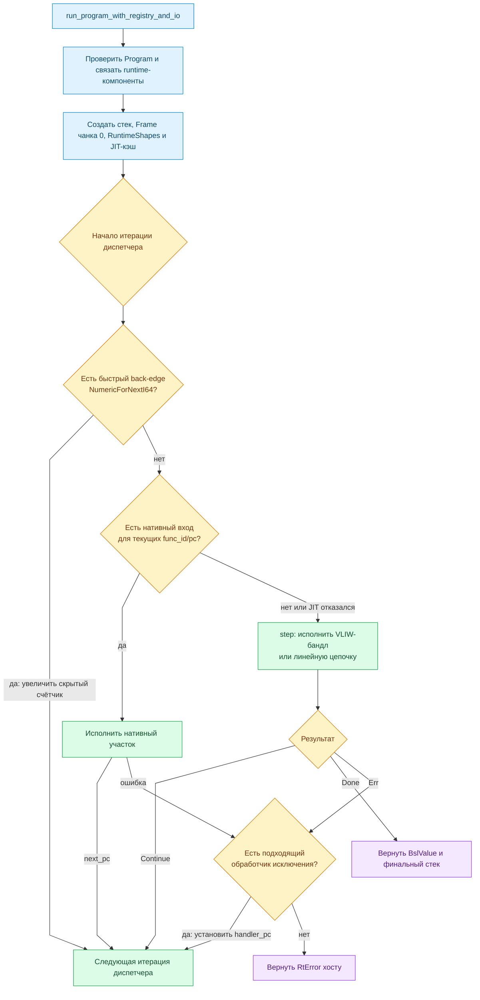
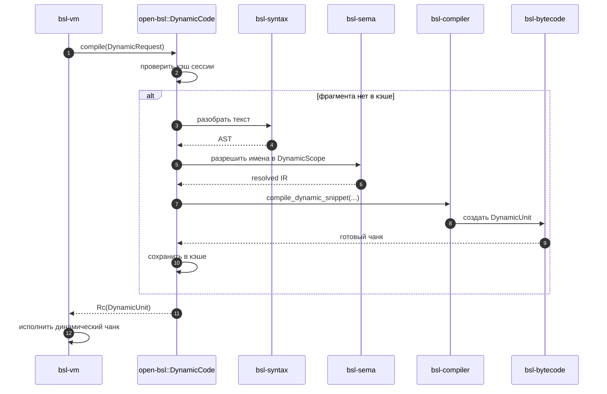

# Компонентная архитектура open-bsl

Документ описывает уровень C4 Component для Rust-библиотеки `open-bsl`.
Крейты workspace считаются компонентами одного поставляемого контейнера:
они собираются вместе, но имеют отдельные обязанности и направленные
зависимости.

Архитектура разделена на несколько представлений. Обзорная диаграмма
показывает только основной поток, таблицы фиксируют точные зависимости, а
отдельная диаграмма последовательности объясняет циклический сценарий
`Выполнить`/`Вычислить`. Такое разделение не даёт стрелкам скрыть структуру.

## Обзор компонентов

Сплошные стрелки показывают основной поток данных. Пунктиром отмечен
альтернативный вход для уже скомпилированного текстового байт-кода.

```mermaid
%%{init: {"flowchart": {"curve": "linear", "nodeSpacing": 30, "rankSpacing": 45}}}%%
flowchart LR
    user["Пользователь"]
    cli["bsl-cli<br/><small>CLI и REPL</small>"]
    host["Rust-приложение<br/><small>встраивает интерпретатор</small>"]
    services["Сервисы хоста<br/><small>ФС, время, random, stdout/stderr</small>"]

    subgraph container["Контейнер: библиотека open-bsl"]
        direction LR
        api["API и композиция<br/><small>open-bsl</small>"]
        syntax["Синтаксис<br/><small>bsl-syntax</small>"]
        sema["Семантика<br/><small>bsl-sema</small>"]
        compiler["Компилятор<br/><small>bsl-compiler</small>"]
        bytecode["Байт-код<br/><small>bsl-bytecode</small>"]
        vm["Исполнение<br/><small>bsl-vm</small>"]
        runtime["Значения и реестр<br/><small>bsl-rt</small>"]
        libraries["Стандартная библиотека<br/><small>подключаемые bsl-* компоненты</small>"]

        api -->|"исходный текст"| syntax
        syntax -->|"AST"| sema
        sema -->|"resolved IR"| compiler
        compiler -->|"Program"| bytecode
        bytecode -->|"Program/Chunk/Instr"| vm
        vm -->|"встроенные вызовы"| runtime
        runtime -->|"дескрипторы"| libraries
        api -.->|"загрузка .bslc"| bytecode
    end

    user --> cli
    cli -->|"запуск файла"| api
    host -->|"публичный Rust API"| api
    vm -->|"разрешённые эффекты"| services

    classDef external fill:#f4f5f7,stroke:#6b7280,color:#111827
    classDef facade fill:#e0f2fe,stroke:#0284c7,color:#0c4a6e
    classDef frontend fill:#fef3c7,stroke:#d97706,color:#78350f
    classDef execution fill:#dcfce7,stroke:#16a34a,color:#14532d
    classDef runtimeStyle fill:#f3e8ff,stroke:#9333ea,color:#581c87

    class user,cli,host,services external
    class api facade
    class syntax,sema,compiler frontend
    class bytecode,vm execution
    class runtime,libraries runtimeStyle
```



Основная линия читается слева направо:

```text
исходник BSL → AST → resolved IR → Program/Chunk/Instr → VM → BslValue/вывод
```

`bsl-cli` для обычного запуска использует фасад `open-bsl`. REPL, подсветка
и служебные команды байт-кода дополнительно обращаются к внутренним слоям
напрямую; эти связи вынесены из обзора в таблицу, чтобы не пересекать
основной поток.

## Зависимости основного тракта

В таблице перечислены normal-зависимости Cargo внутри workspace. Она
отвечает на вопрос «какой компонент знает о каком», тогда как обзорная
диаграмма отвечает на вопрос «как проходит программа».

| Компонент | Ответственность | Прямые внутренние зависимости |
|---|---|---|
| `bsl-syntax` | Лексер, препроцессор, parser, AST и диагностика | — |
| `bsl-sema` | Связывание имён и построение resolved IR | `bsl-syntax`, `bsl-rt`, `bsl-number` |
| `bsl-compiler` | Генерация обычного и динамического байт-кода | `bsl-syntax`, `bsl-sema`, `bsl-bytecode`, `bsl-rt`, `bsl-number` |
| `bsl-bytecode` | `Program`, `Chunk`, `Instr`, VLIW-бандлы, текстовый формат и `DynamicCompiler` | `bsl-rt`, `bsl-number` |
| `bsl-vm` | Интерпретатор и template JIT | `bsl-bytecode`, `bsl-rt`, `bsl-number`, `bsl-format` |
| `bsl-rt` | Значения BSL, коллекции, объекты, host-контракты и `RuntimeRegistry` | `bsl-number` |
| `bsl-format` | Пользовательское представление значений | `bsl-rt`, `bsl-number` |
| `open-bsl` | Публичные `Engine`, `Module`, `State`; композиция runtime-компонентов | Все компоненты основного тракта и включённые Cargo features |
| `bsl-cli` | Файловый запуск, REPL, листинги и приём замеров | `open-bsl` и внутренние слои основного тракта |

Ключевая граница: normal-зависимости `bsl-vm` не содержат `bsl-syntax`,
`bsl-sema` и `bsl-compiler`. VM исполняет представление и не знает, как
оно было получено.

## Как VM исполняет байт-код

### Исполняемые структуры

VM регистровая, а не стековая: арифметические операнды и результаты лежат
в регистрах кадра, явно указанных в полях `Instr`. Отдельного стека
операндов нет. При этом регистры всех активных вызовов физически хранятся
в одном сквозном `Vec<BslValue>`.

| Структура | Что содержит | Как используется при исполнении |
|---|---|---|
| `Program` | Требования к runtime-пакетам, чанки, общие таблицы имён и форм, модульные переменные | Единый неизменяемый образ модуля |
| `Chunk` | Инструкции одной функции, процедуры или верхнего уровня; константы; число регистров; режимы аргументов; обработчики исключений; производные кэши | `chunks[0]` — верхний уровень, `chunks[1..]` — функции и процедуры |
| `Instr` | Опкод и номера его регистров/таблиц | `Copy`-перечисление без битовой упаковки; переходы содержат абсолютный `pc` внутри чанка |
| `Frame` | `func_id`, текущий `pc`, алиасы параметров, начало собственных регистров и место возврата | Описывает один активный вызов, но не владеет отдельным массивом регистров |
| Стек значений | Регистры верхнего уровня и всех вызванных функций | Растёт при `Call`, усекается при `Return` или разматывании исключения |
| `LinkedComponents` | Уже разрешённые обработчики функций и конструкторов компонентов | Позволяет `CallComponent`/`CreateObject` не искать обработчик по имени при каждом вызове |
| `RuntimeShapes` | Имена, формы структур и runtime-типы текущей программы | Используется объектными инструкциями и инлайн-кэшами свойств/методов |

Параметры кадра могут быть алиасами слотов вызывающего. `ArgMode::Value`
указывает на подготовленный временный регистр со значением,
`ByRefLocal`/`ByRefModuleVar` — прямо на переменную вызывающего, а
`Default` помечает пропущенную позицию. Благодаря абсолютным индексам
алиасы не инвалидируются при росте общего `Vec`.

### Подготовка и цикл диспетчеризации

До первой инструкции `link_components` проверяет образ байт-кода,
сопоставляет `Program::requirements` с точными версиями библиотек и
разрешает компонентные коды в адреса обработчиков. Затем VM создаёт стек
регистров чанка `0`, начальный `Frame`, `RuntimeShapes` и, если включён JIT,
по одному ленивому слоту нативного кода на чанк.

Диаграмма показывает одну итерацию диспетчера. Узел «Следующая итерация»
означает возврат к её началу; обратная стрелка намеренно не нарисована,
чтобы не пересекать остальные связи.



В чисто интерпретаторном режиме `step` может продолжить линейное
исполнение через несколько бандлов, не возвращаясь во внешний цикл. Возврат
нужен при переходе, смене кадра, исключении и завершении. С включённым JIT
`step` возвращается после каждого бандла, чтобы внешний цикл не пропустил
позицию возможного входа в нативный код.

### Обработка одной инструкции

`step` берёт верхний `Frame`, по `func_id` выбирает `Chunk`, а по `pc` —
текущую инструкцию. Если `pc` уже за концом чанка, выполняется неявный
`Return` со значением `Неопределено`.

Для обычной инструкции последовательность такова:

1. Вычислить абсолютные индексы её регистров через окно текущего кадра.
2. Безопасно прочитать операнды и записи таблиц. Любой неверный индекс
   превращается в `RtError::InvalidBytecode`, а не в панику процесса.
3. Выполнить исчерпывающую ветку `match Instr`.
4. Записать результат в указанный `dst` и увеличить `pc`, либо явно
   установить `pc` для перехода, вызова или возврата.
5. Вернуть `Continue`, `Done(value)` или ошибку во внешний цикл.

Исполняющие ветки обычно увеличивают `pc` только после успешной операции,
поэтому при ошибке кадр остаётся на сбойнувшей инструкции. `Call` — особый
случай: `pc` вызывающего заранее ставится после вызова, а при разматывании
внешний кадр проверяется по `pc - 1`. Так поиск защищённого диапазона в
обоих случаях получает позицию самой инструкции вызова.

Опкоды сгруппированы по поведению:

| Группа | Основные инструкции | Что меняется |
|---|---|---|
| Загрузка и перемещение | `Move`, `LoadConst`, `LoadBool`, `LoadUndefined`, `LoadNull`, `GetModuleVar`, `SetModuleVar` | Регистры кадра или абсолютные слоты модульных переменных |
| Арифметика и сравнение | `Add`, `AddConst`, `Sub`, `Mul`, `Div`, `Mod`, `Neg`, `Not`, `Eq`, `NotEq`, `Lt`, `Gt`, `Le`, `Ge` | Читаются операнды, в `dst` записывается новый `BslValue` |
| Управление | `Jump`, `JumpIf*`, `NumericForNext*` | `pc` получает абсолютную цель либо переходит к следующей инструкции; условия строго требуют `Булево` |
| Вызов BSL-функции | `Call`, `Return` | Создаётся или снимается `Frame`, растёт или усекается общий стек значений |
| Коллекции и поля | `GetIndex`, `SetIndex`, `GetProp`, `SetProp`, `CollectionLen` | Читаются/меняются коллекции и объекты; свойства используют кэш текущего `pc` |
| Создание значений | `NewArray`, `NewStructure`, `NewTable`, `NewTypeDescription`, `NewValueComparison`, `NewMap`, `NewTextWriter` | Созданный объект записывается в `dst` |
| Runtime-вызовы | `CallBuiltin`, `CallMethod`, `CallComponent`, `CreateObject`, `CallObjectMethod`, `GetObjectProp`, `SetObjectProp` | Аргументы передаются базовому runtime или заранее связанному компоненту через `CallContext` |
| Динамический код | `RunDynamic` | Хост компилирует строку, VM запускает отдельный динамический чанк и переносит назад видимые значения |
| Исключения | `Raise` | Возвращается ловимая ошибка; форма без операнда повторно бросает текущее исключение |

Частые и короткие опкоды исполняются непосредственно в `step`. Крупные
операции — конструирование объектов, компонентные и открытые объектные
вызовы, `Raise`, `RunDynamic` — вынесены в невстраиваемую функцию
`step_cold`. Это деление не меняет семантику: оно удерживает горячий
диспетчер достаточно компактным для кэша микроопераций процессора.

### Вызов и возврат

`Call` сначала продвигает `pc` вызывающего за инструкцию вызова, затем
строит `param_aliases`, добавляет в конец общего стека собственные
регистры вызываемого чанка и помещает новый `Frame` в `frames`. Глубина
ограничена, поэтому бесконечная рекурсия возвращает ловимую ошибку вместо
роста памяти до аварийного завершения процесса.

`Return` снимает верхний кадр. Если вызывающий существует, VM усекает стек
до сохранённого `call_start` и записывает результат в его `return_reg`.
Если снят самый нижний кадр, стек не усекается и VM возвращает
`Done(value)`. Конец чанка без явного `Return` эквивалентен возврату
`Неопределено`.

### VLIW-бандлы

`Chunk::bundle_len[pc]` задаёт число соседних взаимно независимых
инструкций. Внутри бандла нет RAW- и WAW-конфликтов; WAR допускается, а
передача управления может находиться только в последнем члене. VM
исполняет члены последовательно, но одним заходом в диспетчер — это
уменьшает стоимость цикла, а не запускает инструкции параллельно.

Разметка производная: она не сериализуется в `.bslc` и пересчитывается
`bsl_bytecode::bundle::compute` после разбора. Поэтому изменённый вручную
листинг не может подложить VM ложное утверждение о независимости
инструкций.

### Исключения

Каждый `Chunk` хранит `ExceptionRange { start_pc, end_pc, handler_pc }`.
Когда JIT или `step` возвращает ловимую ошибку, `unwind_to_handler`:

1. Ищет самый узкий защищённый диапазон, содержащий текущий `pc`.
2. Если обработчика нет, снимает кадр, усекает его регистры и проверяет
   позицию инструкции `Call` во внешнем кадре.
3. При успехе сохраняет значение текущего исключения, устанавливает
   `pc = handler_pc` и возобновляет цикл.
4. Если кадры закончились, возвращает ошибку Rust-хосту.

Ошибки повреждённого образа (`InvalidBytecode`) намеренно не ловятся
оператором `Попытка`: некорректный байт-код не может завершиться как
успешная BSL-программа.

## Динамическая компиляция

Для `Выполнить` и `Вычислить` VM вызывает переданный контракт
`DynamicCompiler`. Его сессионная реализация `open-bsl::DynamicCode`
прогоняет фрагмент через фронтенд, кэширует результат и возвращает VM
готовый `DynamicUnit`.



Template JIT является внутренней стратегией `bsl-vm`, а не отдельным
контейнером. На x86-64 Linux VM передаёт ему поддержанный чанк; при
неподдержанной инструкции или недоступном исполняемом отображении
исполнение остаётся в интерпретаторе.

## Компоненты стандартной библиотеки

Каждый компонент предоставляет `LibraryDescriptor` и работает через
контракты `bsl-rt`. `EngineBuilder` регистрирует включённые Cargo features
в `RuntimeBuilder`, после чего замораживает единый `RuntimeRegistry`.

| Компонент | Область | Дополнительные внутренние зависимости |
|---|---|---|
| `bsl-binbuf` | Побитовые операции и разбор двоичных/шестнадцатеричных чисел | `bsl-number` |
| `bsl-regexp` | Регулярные выражения BSL | `bsl-number` |
| `bsl-textdoc` | Текстовые документы | — |
| `bsl-json` | Потоковое и полное чтение/запись JSON | — |
| `bsl-stream` | Байтовые потоки, чтение и запись данных | `bsl-binbuf` |
| `bsl-zip` | ZIP и файловые архивы | — |
| `bsl-pdf` | Формирование PDF | — |
| `bsl-xml` | XML, XSD, XPath, DOM и XDTO | — |
| `bsl-spreadsheet` | MXL, XLSX, шаблоны и PDF-раскладка | `bsl-format`, `bsl-pdf`, `bsl-xml` |

У каждого компонента из таблицы также есть прямая зависимость от `bsl-rt`.
Все они включены в стандартный набор features `open-bsl`; встраивающее
приложение может отключить их или зарегистрировать собственный
`LibraryDescriptor`. Внешние crates (`fancy-regex`, `zip`, `flate2`,
`num-bigint`) считаются деталями реализации компонентов.

## Границы схемы

- `open-bsl-consumer` — сборочная проверка полноты публичного фасада, а не
  runtime-компонент продукта, поэтому на диаграмму не включён.
- Скрипты замеров и реальная платформа 1C относятся к контуру разработки и
  проверки совместимости. Во время обычной компиляции и исполнения связи с
  платформой 1C нет.
- Тестовые и dev-зависимости Cargo не показаны.
